---
layout: default
title: Research
---

<link rel="stylesheet" href="{{ '/styles.css' | relative_url }}">

<h1>

Research Projects
</h1>

### [Metabolomic Analysis of Gut Metabolites in Colorectal Cancer Patients (CRC)](https://link.springer.com/article/10.1007/s00726-025-03448-3)

##### Objectives:

Identify metabolite signatures and network-level metabolic disruptions
distinguishing CRC patients from healthy controls.

##### Hurdles:

Low data coverage and a limited number of differentially expressed
metabolites, making it difficult to identify robust discriminative
signatures.

##### Rationale:

Metabolic alterations occur in coordinated patterns. By capturing these
patterns through co-expressed modules correlated with disease status and
exploring knowledge-based metabolite–metabolite interactions within
these modules, it is possible to identify biomarkers and key metabolic
mediators in CRC.

##### Framework:

- Implemented an end-to-end pipeline, including raw data preprocessing,
  PQN normalization, differential expression analysis, WGCNA for module
  discovery, and eigengene differentiation for CRC-specific modules.
- Applied intramodular connectivity to identify hub metabolites.
- Applied PCA/PLS-DA for dimensionality reduction and feature
  prioritization.
  

##### Outcome:

Defined metabolite modules linked to CRC phenotypes, highlighted hub
metabolites as candidate biomarkers, and revealed dysregulated metabolic
networks and pathways.

<h4>

TOM Heatmap
</h4>

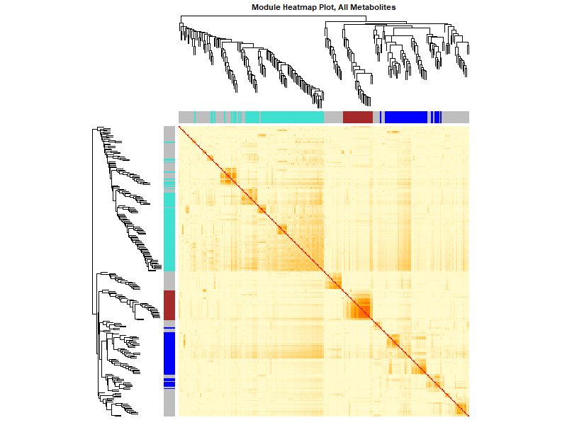

<h4>

PLS-DA VIP Features
</h4>

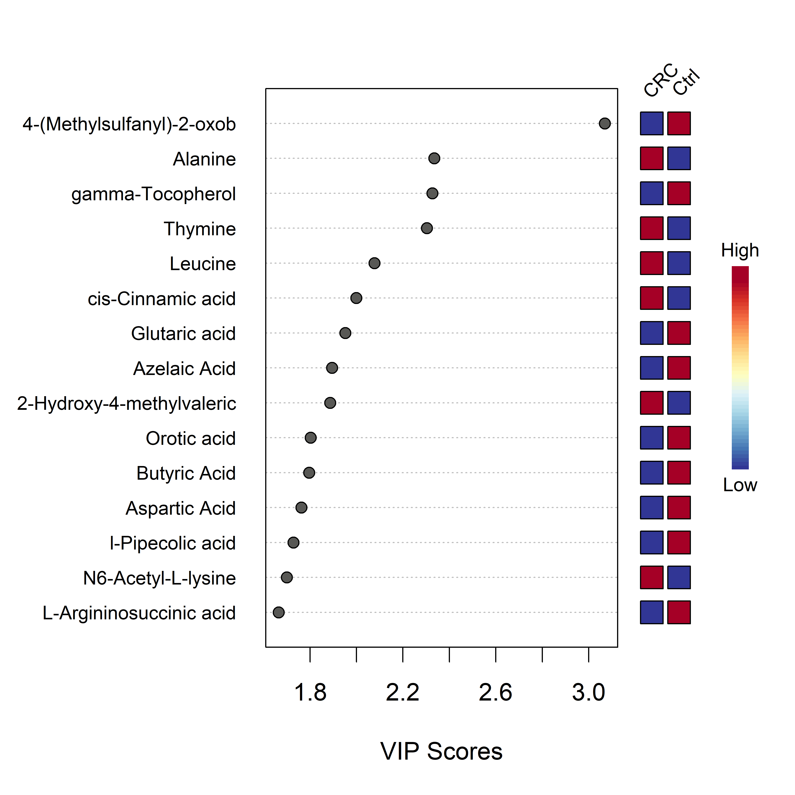

<h4>

Enrichment Analysis
</h4>

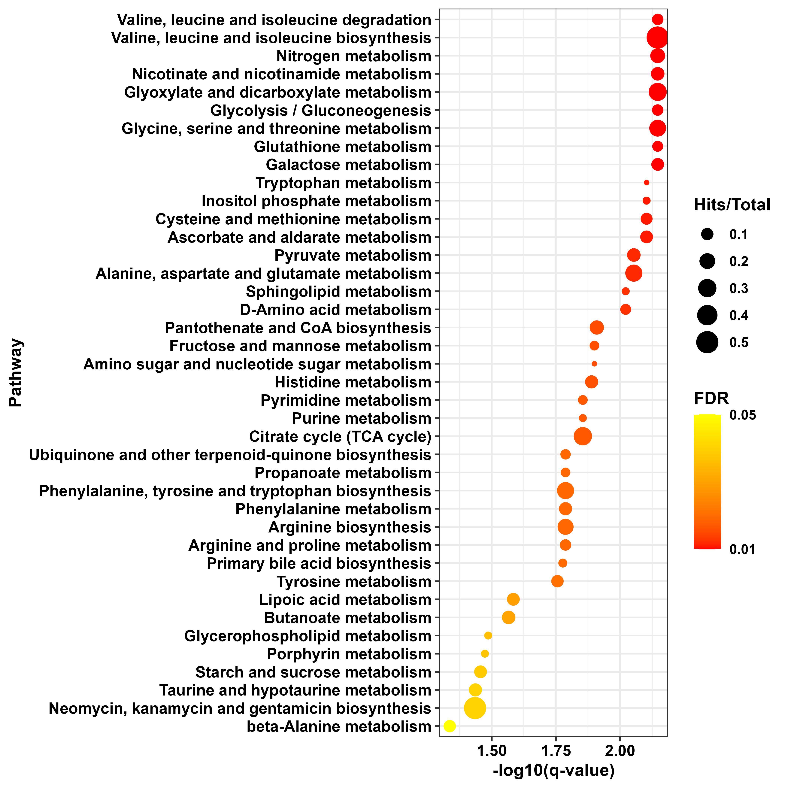

###### Find More

**[Paper
Link](https://link.springer.com/article/10.1007/s00726-025-03448-3)**  
**[Source Code](https://bits-and-bites.netlify.app/)**

------------------------------------------------------------------------

### **[Integrative Multi-Omics Profiling of Rhabdomyosarcoma Subtypes Reveals Distinct Molecular Pathways and Biomarker Signatures](https://www.mdpi.com/2073-4409/14/14/1115)**

##### Objectives:

Uncover subtype-specific molecular signatures and key drivers of RMS
using integrative proteomics and metabolomics.

##### Hurdles:

High heterogeneity across subtypes and difficulty distinguishing
biomarkers specific to each subtype.

##### Rationale:

Rather than focusing on individual genes, identifying altered networks
and their central regulators provides a more comprehensive understanding
of subtype-specific etiologies and therapeutic targets.

##### Framework:

- Applied WGCNA to identify co-expressed modules and tested eigengene
  differentiation using Wilcoxon statistics.
- Constructed PPI networks integrating hub and differentially expressed
  proteins, then applied centrality analysis to identify key drivers.
  

##### Outcome:

Characterized subtype-specific molecular landscapes in RMS, pinpointed
central regulators, and mapped key altered pathways.

<h4>

Module-phenotype Heatmap
</h4>

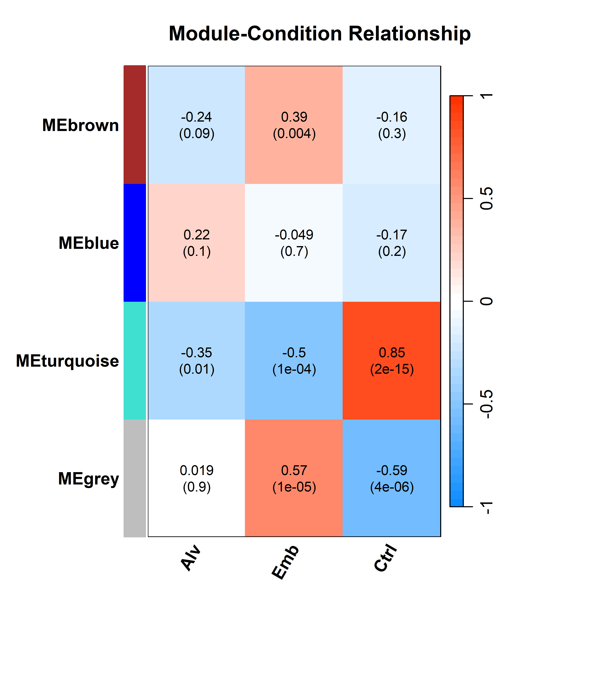

<h4>

Module Eigengene Barplot
</h4>

###### Find More

**[Paper Link](https://www.mdpi.com/2073-4409/14/14/1115)**  
**[Source
Code](https://github.com/Menna-Arafat/Rhabdomyosarcome_project)**

------------------------------------------------------------------------

### CrosstalkX: A Mutual Information–Based Framework for Pathway Interaction Inference

##### Objectives:

Develop a computational tool to detect nonlinear dependencies and
interactions among signaling pathways and transcription factors (TFs).

##### Hurdles:

Traditional correlation-based approaches overlook nonlinear
associations; scalable and robust statistical modeling was required.

##### Rationale:

Pathways function through coordinated interactions rather than isolated
activity. We applied a mutual information algorithm between pathway gene
sets with prior PPI constraints, inferring edges only when significant
mutual information was detected between first-degree interacting genes.
Mutual information was then inferred at the pathway level, with
randomization to assess significance. Significant interactions reveal
functional interplay underlying complex diseases.

##### Framework:

- Developed a mutual information–based inference algorithm in R to
  construct pathway–pathway and pathway–TF interaction networks.
- Core pathways and TFs were prioritized by interaction degree.
  

##### Outcome:

Developed CrosstalkX, an R package for mutual information–based pathway
interaction analysis, enabling the detection of nonlinear dependencies
between pathway gene sets. The tool identifies highly interacting
signaling pathways and prioritizes core pathways with high interaction
degrees, revealing key functional Interplay that potentially coordinate
critical biological processes.

<h4>

Enrichment Plot
</h4>

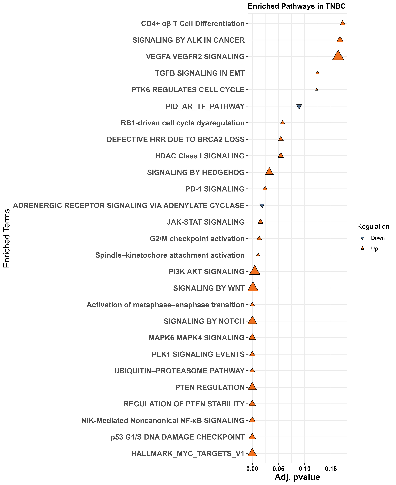

<h4>

Crosstalk Plot
</h4>

<h4>

TF-target Plot
</h4>

###### Find More

**[Source Code](https://github.com/Menna-Arafat/CrosstalkX)**

------------------------------------------------------------------------

### A Multi-Omics and Mutual Information Framework to Decode Pathway Crosstalk and Therapeutic Vulnerabilities in TNBC

##### Objectives:

Prioritize therapeutic targets and repurpose drugs for TNBC by
integrating multi-omics data and pathway crosstalk analysis.

##### Hurdles:

Transcriptome data were highly noisy, with enrichment analysis yielding
nonspecific results. Integration across heterogeneous omics layers made
it difficult to distinguish meaningful pathway interactions from
background noise.

##### Rationale:

Multi-omics integration via MOFA, with ARD-induced sparsity, reduces
noise by setting weights of non-contributing genes close to zero.
TF-target inference applied to MOFA top features, combined with
univariate linear modeling (decoupleR), identifies active TFs.
Centrality algorithms prioritize key targets, while DepMap essentiality
scores validate lethality. Mutual information–based crosstalk analysis
could reveal core interacting pathways. Finally, Macau-based sensitivity
analysis links pathway states to drug responsiveness, exposing
actionable vulnerabilities.

##### Framework:

- Retrieved six-layer TCGA data, applied MOFA for latent factor
  inference, and extracted top features.
- Inferred TF activity with decoupleR, applied centrality analysis, and
  introduced mutual information–based crosstalk.
- Linked central genes and pathways to candidate drugs via CMAP, applied
  network synergy prediction.
- Validated essential targets with DepMap, and incorporated survival
  analysis.
- Implemented Macau for target sensitivity prediction.
  

##### Outcome:

Identified core interacting pathways, prioritized therapeutic targets,
and refined drug combinations aligned with TNBC molecular states.

<h4>

Crosstalk Plot
</h4>

<h4>

Chord Plot
</h4>

<h4>

Heatmap Plot
</h4>

###### Find More

**[Source Code](https://github.com/Menna-Arafat/TNBC_project)**

------------------------------------------------------------------------

### Enhanced Bone Regeneration in Rat Gingival Mesenchymal Stem Cells

##### Objectives:

Characterize molecular programs and cellular contributions driving bone
regeneration under diverse interventions.

##### Hurdles:

Multi-layer temporal datasets across experimental settings with three
time-point measurements each, requiring disentanglement of heterogeneous
cell-type contributions.

##### Rationale:

Factor analysis of spatio-temporal profiles can uncover latent factors
that covary across time points and explain differentiation trajectories.
Understanding these regulatory programs will optimize scaffold- and
laser-based regenerative therapies.

##### Framework:

- Applied MEFISTO for time-resolved integration of protein expression
  data.
- Inferred TF activity with decoupleR, explored pathway crosstalk.
- Applied CIBERSORT deconvolution against a dental cell atlas to map
  protein changes to cell types.
  

##### Outcome:

Revealed time-coordinated regulatory programs, identified TF–pathway
axes, and mapped cell-type contributions enhancing regenerative
efficacy.

<h4>

Upset Plot
</h4>

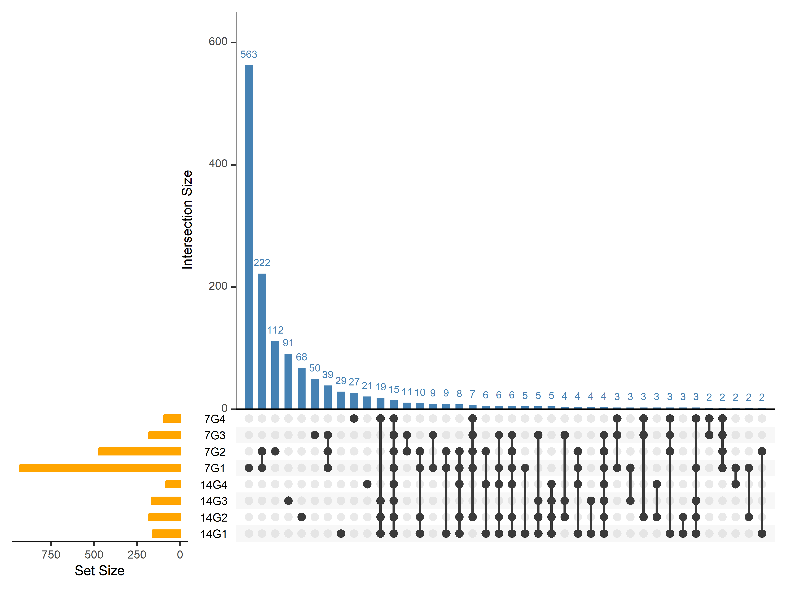

<h4>

Latent Factor1 Plot
</h4>

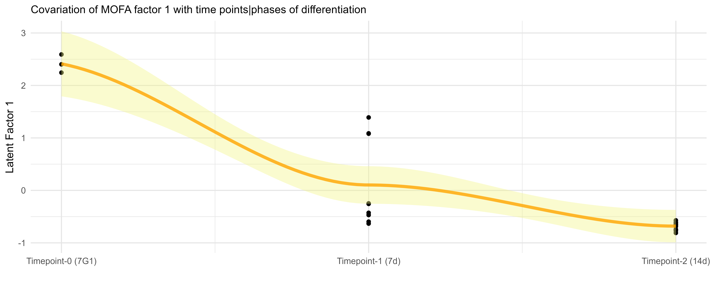

<h4>

Stacked Barplot for SC Deconvolution
</h4>

<h4>

TF-Pathway Crosstalk Plot
</h4>

###### Find More

**[Source Code](https://github.com/Menna-Arafat/GMSC_project)**

------------------------------------------------------------------------

### Integrative Analysis of Extracellular Vesicle miRNAs Reveals Molecular Signatures and Regulatory Networks in Breast Cancer Subtypes

##### Objectives:

Discover extracellular vesicle miRNA signatures and regulatory networks
distinguishing breast cancer subtypes.

##### Hurdles:

Batch variability across multiple datasets and low coverage for some
studies and missing metadata for others.

##### Rationale:

Batch effect correction using limma voom could help git rid of wanted
source of variability. MINT-sPLSDA could offer a robust way of
integrating data through harmonizing data using z scoring and then allow
us to choose the best number of components to integrate the datasets
that allow better classification between groups. miRNA does not work
individually usually more than miRNA targeting the same gene change
together and thus we could prioritize differentially expressed miRNA for
each subtypes by setting the condition that at least 3 mirna targeting
the same genes should be differentially expressed to infer translational
molecular alteration.

##### Framework:

- Preprocessed and batch-corrected datasets.
- Applied MINT-sPLS-DA for multivariate integration and subtype
  classification.
- Constructed miRNA–target networks requiring triply supported
  interactions, and performed enrichment analyses.
  

##### Outcome:

Identified discriminative miRNA panels for subtype classification,
uncovered key pathways under vesicle-miRNA regulation, and proposed
subtype-specific molecular biomarkers and potential molecularly altered
networks.

<h4>

Heatmap for BC vs Ctrl
</h4>

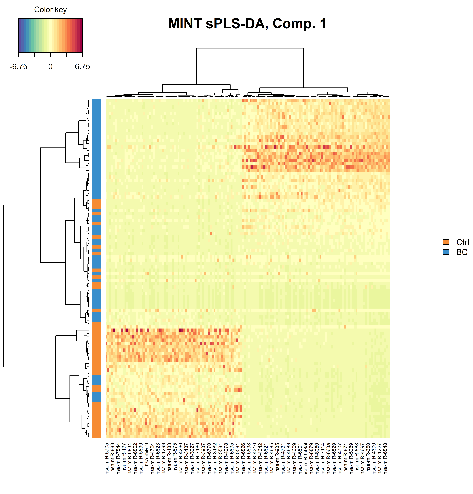

<h4>

ROC Curve for BC vs Ctrl
</h4>

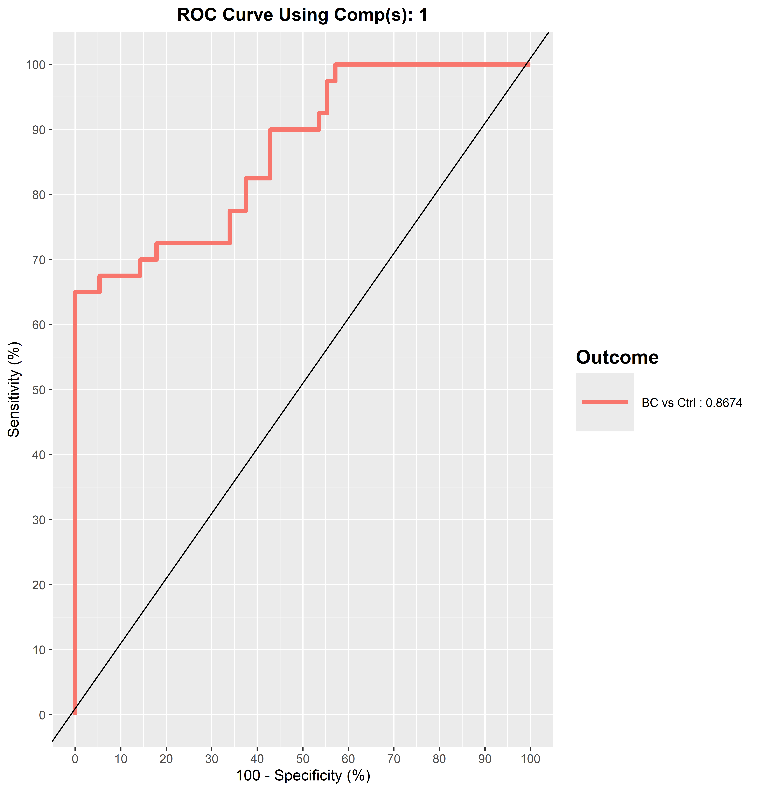

<h4>

Heatmap for BC Subtypes
</h4>

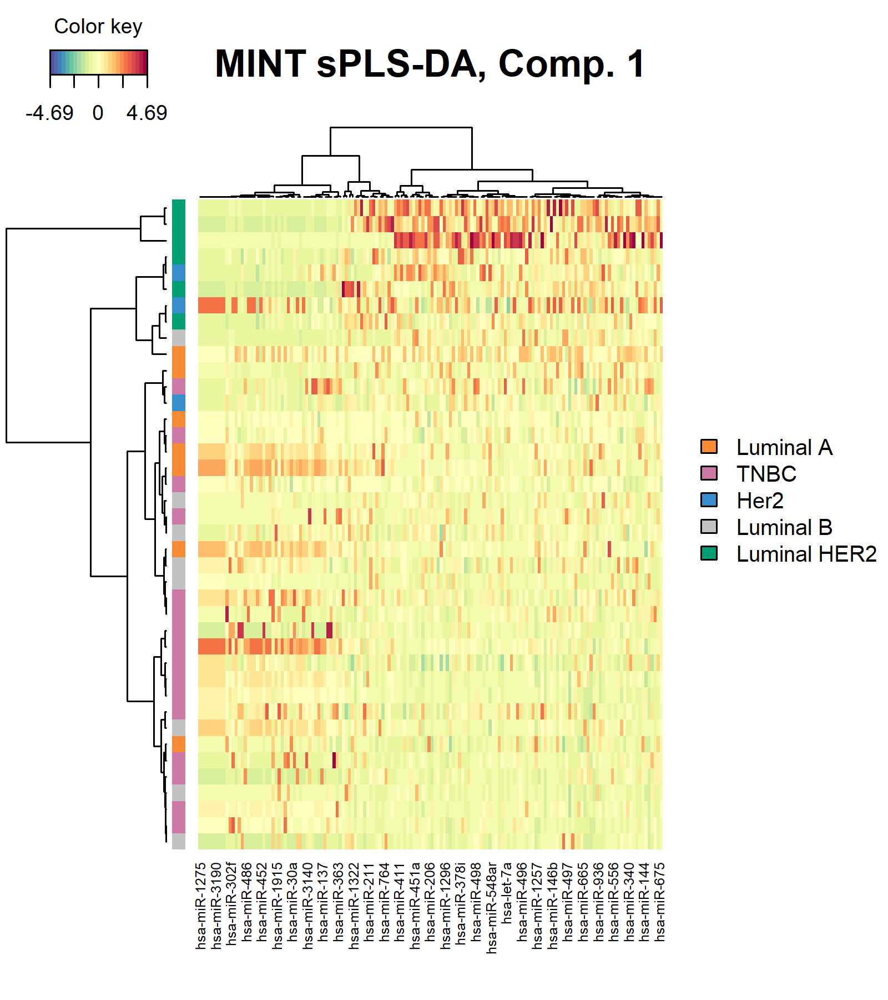

<h4>

ROC Curve for BC Subtypes
</h4>

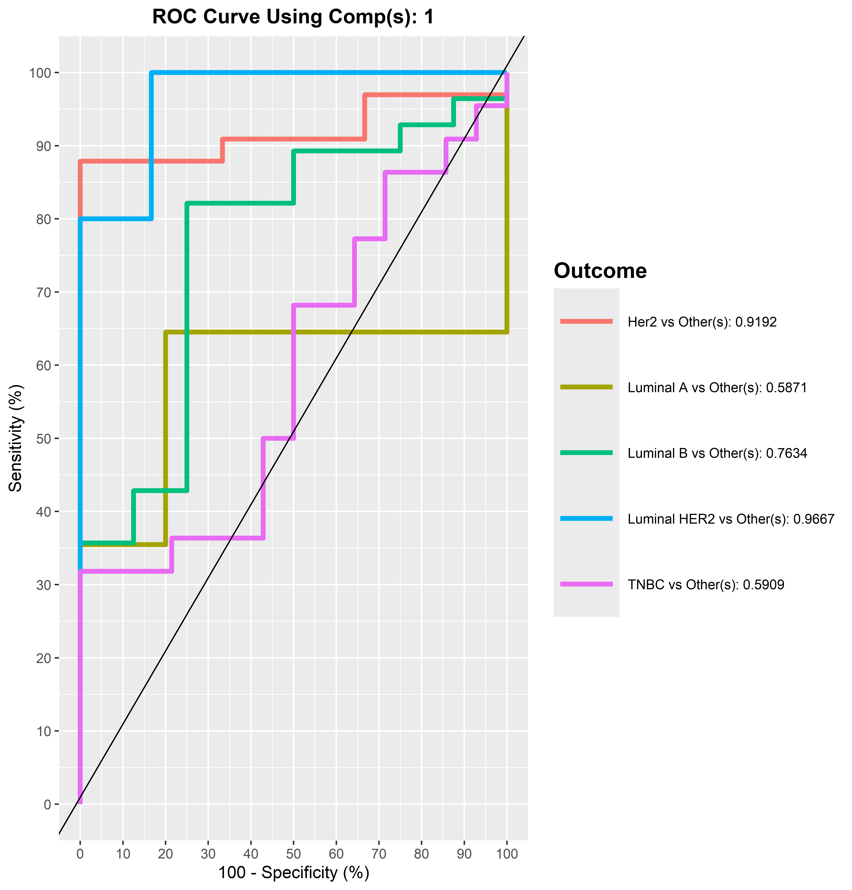

###### Find More

**[Source Code](https://github.com/Menna-Arafat/BC_EVs_miRNA)**

------------------------------------------------------------------------

### Proteomic Profiling of Pancreatic Cancer Patients: Time Series Study Before and After Whipple Surgery

##### Objectives:

Track temporal protein dynamics and functional reorganization in
pancreatic cancer patients undergoing Whipple surgery without developing
diabetic complications.

##### Hurdles:

Identifying signatures correlated with long-term glycemic stability
rather than short-term post-surgical responses.

##### Rationale:

Surgery induces systemic proteomic changes. Mapping these dynamics
reveals stress responses, repair mechanisms, and processes contributing
to stable glycemic control.

##### Framework:

Applied WGCNA to detect co-expression modules and correlated eigengenes
with time metadata. For the module associated with recovery (time point
3), modeled temporal changes using GAMs with patient-specific
intercepts. Identified hub proteins (datKME \> 0.85), integrated with
STRING-based PPI networks, applied Louvain clustering, and performed
enrichment analysis.

##### Outcome:

Highlighted dynamic proteomic modules, identified central hub proteins
in recovery, and revealed pathway modules with coordinated activity and
crosstalk relevant to post-surgical adaptation.

<h4>

Module-phenotype Heatmap
</h4>

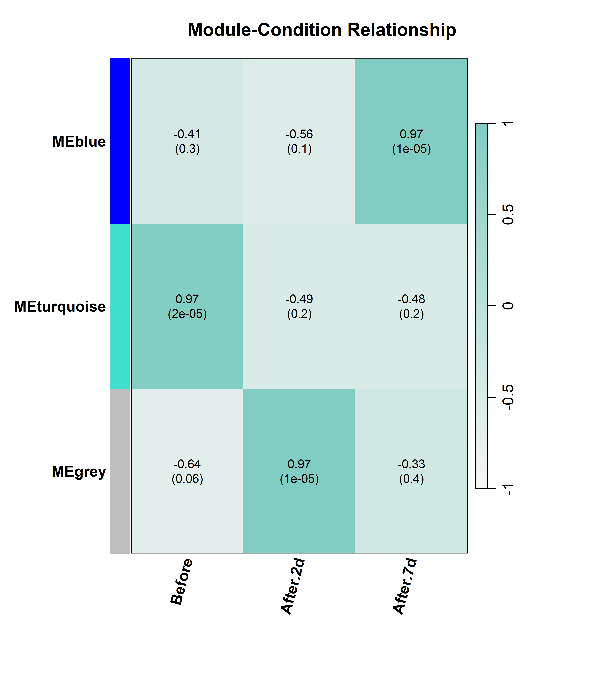

<h4>

GAM Plot
</h4>

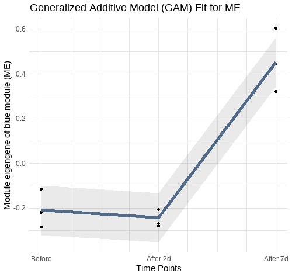

<h4>

PPI network & Louvain Detected Communities
</h4>

<h4>

Enriched Pathways in Blue Module
</h4>

###### Find More

**[Source
Code](https://github.com/Menna-Arafat/Whiple_surgery_project)**

------------------------------------------------------------------------

